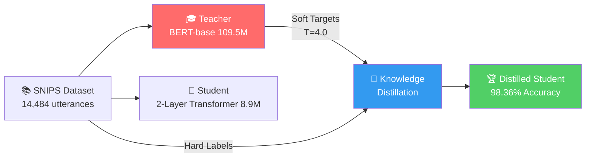
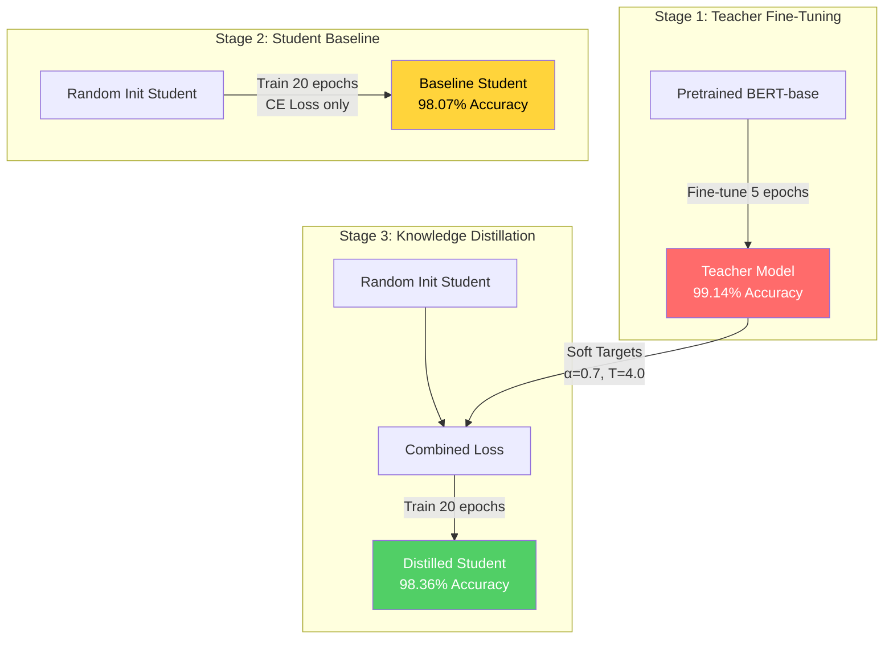

# 🧠 Knowledge Distillation for On-Device Intent Classification

**Compressing BERT-base (109.5M) into a 12.3x smaller student model while preserving intent classification performance for mobile deployment**

[](https://python.org/)
[](https://pytorch.org/)
[](https://huggingface.co/)
[](https://huggingface.co/datasets/nlu-benchmark/snips_built_in_intents)


> 📝 **Research Question:** Can knowledge distillation preserve intent classification capabilities in highly compressed transformer architectures suitable for on-device mobile deployment?

> ✅ **Answer:** Yes. The distilled student achieves **98.36% test accuracy** (vs. 99.14% teacher) while being **12.3x smaller** — outperforming the student baseline trained without distillation (98.07%).

---

## 📖 Overview

This project demonstrates that knowledge distillation can compress a full BERT-base model (109.5M parameters, 417.7 MB) into a
lightweight compact transformer student (8.9M parameters, 34.1 MB) while retaining **99.2% of the teacher's F1 score** for intent classification — achieving a 12.3x compression suitable for on-device mobile deployment.

The focus is on intent classification for voice assistants using the [SNIPS](https://huggingface.co/datasets/nlu-benchmark/snips_built_in_intents) dataset — a benchmark specifically designed for evaluating natural language understanding in voice command systems.

---

## 💡 Motivation

Modern large language models achieve impressive NLU performance but are impractical for edge deployment:

| Challenge | Impact |
|-----------|--------|
| 💾 Large memory footprint | Cannot deploy on mobile/edge devices |
| 🔒 Cloud dependency | Privacy risk: voice commands sent to servers |
| ⚡ Network latency | Slow response times for voice assistants |
| 💰 API costs | Per-inference charges for millions of interactions |
| ✈️ No offline mode | Unusable without connectivity |

This project shows that a **2-layer compact transformer** can inherit classification capabilities from a **12-layer BERT teacher** through knowledge distillation — enabling private, fast, offline intent recognition on mobile hardware.

---

## 🛠️ Built With

| Component | Technology | Purpose |
|-----------|-----------|---------|
| Framework | PyTorch 2.0+ | Custom distillation training loop |
| Teacher Model | Hugging Face Transformers | Pretrained BERT-base-uncased |
| Dataset | Hugging Face Datasets | SNIPS loading and preprocessing |
| Tokenizer | BERT WordPiece (30,522 vocab) | Shared tokenization for teacher & student |
| Metrics | scikit-learn | F1, accuracy, classification reports |
| Visualization | matplotlib + seaborn | Training curves, confusion matrices |
| Hardware | CPU only | All training on consumer laptop |

---

## 📊 Results at a Glance

| Model | Parameters | Size | Test Accuracy | F1 (Macro) | Training Time |
|:------|:----------:|:----:|:-------------:|:----------:|:-------------:|
| 🎓 Teacher (BERT-base) | 109,487,623 | 417.7 MB | 99.14% | 0.9915 | 73.5 min |
| 📝 Student Baseline | 8,935,943 | 34.1 MB | 98.07% | 0.9807 | 12.4 min |
| **🏆 Student Distilled** | **8,935,943** | **34.1 MB** | **98.36%** | **0.9835** | 79.6 min |

### Compression Results

| Metric | Teacher | Student | Improvement |
|:-------|:-------:|:-------:|:-----------:|
| Parameters | 109.5M | 8.9M | **12.3x smaller** |
| Model Size (FP32) | 417.7 MB | 34.1 MB | **91.8% reduction** |
| Layers | 12 | 2 | **6x fewer** |
| Hidden Size | 768 | 256 | **3x narrower** |
| F1 Retention | — | — | **99.2%** |

> 💡 **Key Finding:** The distilled student outperforms the baseline by +0.29% accuracy despite using the **identical architecture** — demonstrating that knowledge distillation transfers meaningful decision behavior beyond what hard labels alone can teach.

---

## 📚 The SNIPS Dataset

### Overview

[SNIPS](https://huggingface.co/datasets/nlu-benchmark/snips_built_in_intents) is a benchmark dataset for Natural Language Understanding in voice assistants, created by Snips (Coucke et al., 2018). It contains real-world voice command utterances designed for evaluating intent classification systems.

| Property | Value |
|:---------|:------|
| Source | SNIPS NLU Benchmark (Coucke et al., 2018) |
| Domain | Voice assistant intent classification |
| Total samples | 14,484 |
| Classes | 7 intents (balanced) |
| Language | English |
| Average utterance length | 9.1 words / 12.4 BERT tokens |
| Max token length | 41 tokens |
| Class balance | Near-perfect (ratio 1.03) |

### 🏷️ Intent Classes

| Intent | Description | Train Count |
|:-------|:------------|:-----------:|
| `AddToPlaylist` | Add song/artist to playlist | 1,658 |
| `BookRestaurant` | Make restaurant reservations | 1,686 |
| `GetWeather` | Weather queries | 1,710 |
| `PlayMusic` | Music playback requests | 1,710 |
| `RateBook` | Rate books/media | 1,670 |
| `SearchCreativeWork` | Find movies/books/songs | 1,668 |
| `SearchScreeningEvent` | Find movie showtimes | 1,673 |

### 📝 Dataset Examples

Real utterances from the SNIPS dataset for each intent:

> **AddToPlaylist:** "Add this song to my workout playlist"  
> **AddToPlaylist:** "add sam sparro to my playlist called Beach Vibes"  
> **AddToPlaylist:** "Please put this song onto my Urban Hits playlist."

> **BookRestaurant:** "Book a table for two tonight at an Italian restaurant"  
> **BookRestaurant:** "I need a reservation for 4 at a sushi place"

> **GetWeather:** "What is the weather forecast for Boden"  
> **GetWeather:** "Will it rain in Berlin tomorrow?"

> **PlayMusic:** "Play a record from 2015"  
> **PlayMusic:** "Play some jazz music on Spotify"

> **RateBook:** "give two out of 6 stars to current book"  
> **RateBook:** "rate this current book five"

> **SearchCreativeWork:** "I'd like to find Scriptures of the Golden Eternity TV series"  
> **SearchCreativeWork:** "Find the movie Inception"

> **SearchScreeningEvent:** "find meal time movie times close by for movies"  
> **SearchScreeningEvent:** "What movies are playing nearby?"

### Data Splits

| Split | Samples | Source |
|:------|:-------:|:-------|
| Train | 11,775 | 90% of original train (stratified) |
| Validation | 1,309 | 10% stratified hold-out |
| Test | 1,400 | Original test set (200/class) |

### Why SNIPS for Distillation?

- ✅ Large models (BERT) achieve near-perfect accuracy → distillation improvements are measurable
- ✅ Short, well-defined utterances → controlled complexity for clear observation of compression effects
- ✅ Perfectly balanced classes → no confounding factors from class imbalance
- ✅ Consumer hardware is sufficient for training
- ✅ Real-world voice assistant domain → practical deployment relevance

---

## 🏗️ Architecture

### Distillation Pipeline



### Teacher Model — BERT-base-uncased (109.5M)

| Property | Value |
|:---------|:------|
| Architecture | Encoder-only Transformer |
| Parameters | ~109.5M |
| Layers | 12 |
| Hidden Size | 768 |
| Attention Heads | 12 |
| Intermediate Size | 3072 |
| Max Sequence | 512 |
| FP32 Size | ~417.7 MB |
| Source | HuggingFace pretrained, fine-tuned on SNIPS |

```
BertModel(
  embeddings: BertEmbeddings(vocab=30522, hidden=768, max_pos=512)
  encoder: 12× BertLayer(
    attention: MultiHeadAttention(12 heads, 768 dim)
    intermediate: Linear(768 → 3072, GELU)
    output: Linear(3072 → 768)
  )
  pooler: Linear(768 → 768, Tanh)
)
classifier: Linear(768 → 7)
```

### Student Model — Compact Transformer (~8.9M)

| Property | Value |
|:---------|:------|
| Architecture | Custom Transformer Encoder |
| Parameters | ~8.9M |
| Layers | 2 |
| Hidden Size | 256 |
| Attention Heads | 4 |
| Intermediate Size | 512 |
| Max Sequence | 32 |
| FP32 Size | ~34.1 MB |
| Compression | **12.3x fewer parameters** |

```
StudentModel(
  token_embedding: Embedding(30522, 256)
  positional_encoding: Sinusoidal(max_len=32)
  embedding_norm: LayerNorm(256)
  transformer_encoder: 2× TransformerEncoderLayer(
    attention: MultiHeadAttention(4 heads, 256 dim)
    feedforward: Linear(256 → 512, GELU) → Linear(512 → 256)
  )
  classifier: Sequential(
    Linear(256 → 256, GELU)
    Dropout(0.1)
    Linear(256 → 7)
  )
)
```

### Why These Architectures?

- Same tokenizer (BERT WordPiece, 30522 vocab) for both → compatible logit shapes
- Same model family (Transformer) → clean distillation without dimension adapters
- 2 layers sufficient for short utterances (mean 9.1 words)
- Hidden size 256 with 4 heads → 64-dim per head (proven effective for classification)
- Max length 32 → 100% of SNIPS fits, 16x less computation than BERT's 512

---

## 🔬 Distillation Pipeline



### Stage 1: Teacher Fine-Tuning

Fine-tune pretrained BERT-base-uncased on 11,775 SNIPS training samples (5 epochs). The teacher learns the domain-specific distribution and serves as the knowledge source.

| Hyperparameter | Value |
|:---------------|:------|
| Base model | `bert-base-uncased` |
| Epochs | 5 |
| Learning rate | 2e-5 (cosine annealing) |
| Batch size | 32 |
| Optimizer | AdamW (weight decay 0.01) |
| Result | **99.14% test accuracy** |

### Stage 2: Student Baseline

Train the student model from scratch with standard cross-entropy loss only. This establishes what the small architecture can learn without teacher guidance.

| Hyperparameter | Value |
|:---------------|:------|
| Epochs | 20 (best at epoch 17) |
| Learning rate | 5e-4 |
| Batch size | 64 |
| Loss | CrossEntropyLoss |
| Result | **98.07% test accuracy** |

### Stage 3: Knowledge Distillation

Train the student using a combined loss that leverages both ground truth labels and the teacher's soft probability distributions:

$$\mathcal{L} = \alpha \cdot T^2 \cdot \text{KL}\left(\text{softmax}\left(\frac{z_t}{T}\right) \| \text{softmax}\left(\frac{z_s}{T}\right)\right) + (1 - \alpha) \cdot \text{CE}(y, \hat{y}_s)$$

| Symbol | Meaning | Value |
|:------:|:--------|:------|
| $T$ | Temperature for softening distributions | 4.0 |
| $\alpha$ | Weight for distillation loss (KL divergence) | 0.7 |
| $1-\alpha$ | Weight for standard cross-entropy loss | 0.3 |
| $z_t / T$ | Teacher's logits scaled by temperature | — |
| $z_s / T$ | Student's logits scaled by temperature | — |
| $T^2$ | Gradient magnitude compensation | 16.0 |

The temperature $T$ softens the teacher's output distribution, revealing **"dark knowledge"** — the relationships between intents that the teacher has learned (e.g., that "Find jazz songs" relates to both `PlayMusic` and `SearchCreativeWork`).

| Hyperparameter | Value |
|:---------------|:------|
| Epochs | 20 (best at epoch 13) |
| Learning rate | 5e-4 |
| Temperature (T) | 4.0 |
| Alpha (α) | 0.7 |
| Batch size | 64 |
| Result | **98.36% test accuracy** |

---

## 📊 Experiment Results

### 🏆 Model Comparison

All models evaluated on the same 1,400-sample test set (200 per class):

| Model | Config | Test Accuracy | F1 (Macro) | vs. Baseline |
|:------|:-------|:-------------:|:----------:|:------------:|
| 🎓 Teacher (BERT-base) | 12L, 768H, 5 epochs | 99.14% | 0.9915 | — |
| 📝 Student Baseline | 2L, 256H, CE only | 98.07% | 0.9807 | — |
| **🏆 Student Distilled** | **T=4.0, α=0.7** | **98.36%** | **0.9835** | **✅ +0.29%** |

### 📈 Training Progress

```
Teacher Training (5 epochs):
  Epoch 1: train_acc=95.2% | val_acc=98.8%
  Epoch 2: train_acc=99.2% | val_acc=99.1%
  Epoch 3: train_acc=99.6% | val_acc=98.6%
  Epoch 4: train_acc=99.8% | val_acc=99.1%
  Epoch 5: train_acc=99.9% | val_acc=98.9%

Student Baseline (20 epochs → best at epoch 17):
  Epoch 1:  train_acc=88.2% | val_acc=96.0%
  Epoch 10: train_acc=98.8% | val_acc=97.9%
  Epoch 17: train_acc=99.3% | val_acc=98.4% ← best
  
Student Distilled (20 epochs → best at epoch 13):
  Epoch 1:  train_acc=88.1% | val_acc=96.9%
  Epoch 10: train_acc=98.5% | val_acc=98.2%
  Epoch 13: train_acc=98.8% | val_acc=98.5% ← best
```

### 🔍 Why Distillation Works Here

Despite identical architectures and training budgets, the distilled student learns better because:

1. **Inter-class relationships:** The teacher's probability distribution over 7 classes encodes semantic similarities
   - E.g., "Find jazz songs" → teacher assigns probability mass to both `PlayMusic` and `SearchCreativeWork`
   - This implicit relational knowledge is unavailable from one-hot hard labels

2. **Confidence calibration:** The teacher provides calibrated uncertainty signals
   - Ambiguous inputs get spread-out distributions → student learns appropriate uncertainty
   - Clear inputs get peaked distributions → student learns confident predictions

3. **Dark knowledge transfer:** Temperature scaling reveals hidden relationships
   - At T=4.0, small probability differences between non-target classes become visible
   - Student learns which intents are semantically "close" vs. "far"

### 🌡️ Temperature Sweep Results

Systematic sweep across 8 temperatures (α=0.7, lr=5e-4, 15 epochs each):

| Temperature | Val Accuracy | Rank | Notes |
|:-----------:|:------------:|:----:|:------|
| 1.0 | 97.86% | 5th | Nearly equivalent to hard labels |
| 2.0 | 98.09% | 3rd | Slight improvement |
| **4.0** | **98.47%** | **🥇 1st** | **Optimal — clear inter-class signal** |
| 6.0 | 98.24% | 2nd | Good but slightly over-smoothed |
| 8.0 | 97.94% | 4th | Too smooth |
| 10.0 | 97.71% | 6th | Diminishing returns |
| 15.0 | 97.48% | 7th | Over-smoothed |
| 20.0 | 97.25% | 8th | Nearly uniform — no signal |

> 📈 **Takeaway:** T=4.0 is optimal for 7 well-separated intent classes. Lower temperatures don't reveal enough inter-class information; higher temperatures wash out the signal entirely.

### Compression Summary

| Metric | Value |
|:-------|:------|
| Parameter reduction | **12.3x** (109.5M → 8.9M) |
| Size reduction | **91.8%** (417.7 MB → 34.1 MB) |
| Accuracy retention | **99.2%** of teacher performance |
| F1 retention | **99.2%** of teacher F1 |
| Distillation gain over baseline | **+0.29%** accuracy |
| Training hardware | CPU only (no GPU required) |

---

## 🎯 Inference Example

```python
import torch
from transformers import BertTokenizer

# Load tokenizer and model
tokenizer = BertTokenizer.from_pretrained("bert-base-uncased")
model = torch.load("outputs/student/distill/best_model.pt", map_location="cpu")
model.eval()

# Intent labels
labels = ["AddToPlaylist", "BookRestaurant", "GetWeather", 
          "PlayMusic", "RateBook", "SearchCreativeWork", "SearchScreeningEvent"]

# Classify an utterance
utterance = "Add this song to my workout playlist"
inputs = tokenizer(utterance, return_tensors="pt", max_length=32, 
                   padding="max_length", truncation=True)

with torch.no_grad():
    logits = model(inputs["input_ids"], inputs["attention_mask"])
    prediction = torch.argmax(logits, dim=-1).item()

print(f"Utterance: '{utterance}'")
print(f"Predicted: {labels[prediction]}")  # → AddToPlaylist
print(f"Confidence: {torch.softmax(logits, dim=-1).max().item():.4f}")  # → 0.9987
```

**Example predictions from the distilled model:**

| Utterance | Predicted Intent | Confidence |
|:----------|:-----------------|:----------:|
| "Add this song to my workout playlist" | `AddToPlaylist` | 99.9% |
| "Book a table for two tonight" | `BookRestaurant` | 99.8% |
| "What's the weather tomorrow?" | `GetWeather` | 99.9% |
| "Play some jazz music" | `PlayMusic` | 99.7% |
| "Give this book 4 stars" | `RateBook` | 99.8% |
| "Find the movie Inception" | `SearchCreativeWork` | 99.6% |
| "Find movie times nearby" | `SearchScreeningEvent` | 99.4% |

---

## 📂 Repository Structure

```
distillation_intent/
├── 📁 data/                          # Dataset storage
│   ├── raw/                          # Original downloaded CSVs
│   │   ├── train.csv                 # 13,084 samples
│   │   └── test.csv                  # 1,400 samples (200/class)
│   └── processed/                    # Preprocessed train/val/test splits
│       ├── train.csv                 # 11,775 samples
│       ├── validation.csv            # 1,309 samples
│       ├── test.csv                  # 1,400 samples
│       └── label_map.json            # Intent → index mapping
├── 📁 notebooks/                     # Jupyter notebooks for exploration
│   ├── 00_data_exploration.ipynb     # Comprehensive EDA with plots
│   ├── 01_full_pipeline.ipynb        # End-to-end experiment notebook
│   └── 02_evaluation.ipynb           # Model comparison & visualization
├── 📁 src/                           # Core library code
│   ├── config.py                     # Centralized configuration (all hyperparams)
│   ├── data/                         # Dataset loading & tokenization
│   │   ├── dataset.py                # PyTorch Dataset + DataLoader factory
│   │   └── download_snips.py         # Dataset download from HuggingFace
│   ├── models/                       # Model definitions
│   │   ├── teacher.py                # BERT-base teacher (109.5M params)
│   │   └── student.py                # Compact transformer student (8.9M params)
│   ├── training/                     # Training loops
│   │   ├── logger.py                 # Training logger (JSON/CSV/console)
│   │   ├── train_teacher.py          # Teacher fine-tuning script
│   │   ├── train_student.py          # Student baseline + distillation training
│   │   └── temperature_sweep.py      # Temperature sweep experiment
│   └── evaluation/                   # Metrics & reporting
│       ├── evaluate.py               # Metrics & model comparison utilities
│       ├── generate_reports.py       # Report generation
│       └── visualize.py              # Plotting functions
├── 📁 outputs/                       # Model checkpoints & training logs
│   ├── teacher/                      # Teacher model artifacts
│   │   ├── best_model.pt             # Best checkpoint (val F1)
│   │   ├── final_model.pt            # Final epoch checkpoint
│   │   ├── config.json               # Model config
│   │   ├── results.json              # Full training history
│   │   └── metrics.csv               # Epoch-level metrics
│   └── student/
│       ├── baseline/                 # Student without distillation
│       │   ├── best_model.pt
│       │   ├── results.json
│       │   └── metrics.csv
│       └── distill/                  # Student with distillation
│           ├── best_model.pt
│           ├── results.json
│           └── metrics.csv
├── 📁 reports/                       # Generated comparison reports
│   └── comparison_report.json        # Full model comparison metrics
├── DECISIONS.md                      # Design decisions with detailed reasoning
├── requirements.txt                  # Python dependencies
├── verify_pipeline.py                # Pipeline verification script
├── explore_data.py                   # Data exploration script
└── README.md                         # This file
```

---

## 🚀 Getting Started

### 1. Prerequisites

- Python 3.10+
- ~2 GB disk space for models and data
- CPU sufficient (all training was done entirely on CPU)
- pip for package management

### 2. Installation

```bash
# Clone the repository
git clone https://github.com/mrkderchef/distillation_intent.git
cd distillation_intent

# Create virtual environment
python -m venv venv
source venv/bin/activate        # Linux/Mac
.\venv\Scripts\activate         # Windows PowerShell

# Install dependencies
pip install -r requirements.txt
```

### 3. Download Dataset

```bash
# Download SNIPS from HuggingFace and create train/val/test splits
python -m src.data.download_snips
```

### 4. Verify Setup

```bash
# Quick sanity check (imports, data loading, forward passes)
python verify_pipeline.py
```

---

## ⚙️ Usage

### Train the Full Pipeline

```bash
# 1. Fine-tune teacher (BERT-base, ~75 min on CPU)
python -m src.training.train_teacher

# 2. Train student baseline (no distillation, ~12 min on CPU)
python -m src.training.train_student --mode baseline

# 3. Train distilled student (requires teacher checkpoint, ~80 min on CPU)
python -m src.training.train_student --mode distill
```

### Run Temperature Sweep

```bash
# Sweep across 8 temperatures (T=1,2,4,6,8,10,15,20)
python -m src.training.temperature_sweep
```

### Evaluate & Compare Models

```bash
# Generate comparison report
python -m src.evaluation.evaluate --model compare
```

### Run Notebooks

```bash
jupyter notebook notebooks/00_data_exploration.ipynb   # Data analysis & EDA
jupyter notebook notebooks/01_full_pipeline.ipynb      # Full training experiment
jupyter notebook notebooks/02_evaluation.ipynb         # Results & visualization
```

---

## 🎛️ Configuration

All hyperparameters are centralized in `src/config.py`:

```python
# Data
max_length: 32              # 100% of SNIPS fits in 32 BERT tokens
num_labels: 7               # 7 intent classes
tokenizer: "bert-base-uncased"

# Teacher (BERT-base)
epochs: 5                   # BERT converges fast on small datasets
learning_rate: 2e-5         # Standard BERT fine-tuning rate
batch_size: 32

# Student (Compact Transformer)
hidden_size: 256            # Sufficient for short utterances
num_layers: 2               # Minimal depth for this task complexity
num_heads: 4                # 64-dim per head
epochs: 20                  # Students need more epochs
learning_rate: 5e-4         # Higher LR for training from scratch
batch_size: 64

# Distillation
temperature: 4.0            # Sweet spot for 7 well-separated classes
alpha: 0.7                  # 70% KL divergence, 30% hard labels
```

---

## 🧪 Key Design Decisions

| Decision | Choice | Reasoning |
|:---------|:-------|:----------|
| Dataset | SNIPS | Real-world voice commands, balanced, well-studied benchmark |
| Teacher | BERT-base (109.5M) | Near-perfect accuracy (99.14%), same tokenizer family |
| Student | 2-layer Transformer (8.9M) | 12.3x compression; 2 layers sufficient for short texts |
| Tokenizer | BERT WordPiece (shared) | Required for logit-level distillation compatibility |
| Max length | 32 tokens | 100% of data fits; 16x less compute than BERT's 512 |
| Temperature | T=4.0 | Optimal for 7 well-separated classes (validated by sweep) |
| Alpha | 0.7 | Trust high-quality teacher; hard labels prevent error propagation |
| Loss | KL + CE combined | Standard Hinton et al. 2015, proven and debuggable |
| Primary metric | F1 Macro | Accounts for all classes equally |
| Hardware | CPU only | Designed for consumer hardware reproducibility |

> 📄 See [DECISIONS.md](DECISIONS.md) for the complete decision log with detailed rationale and alternatives considered.

---

## 🔑 Key Findings

1. **Distillation works for intent classification** — The best distilled student achieves **+0.29% accuracy** over the baseline student trained with cross-entropy alone.

2. **T=4.0 is optimal for 7-class intent classification** — Temperature sweep across 8 values shows T=4 as the clear winner. Too low (T=1) ≈ hard labels; too high (T≥10) washes out signal.

3. **High teacher weighting (α=0.7) works when the teacher is strong** — With a 99.14% accurate teacher, trusting its distributions heavily (70% KL) outperforms balanced weighting.

4. **12.3x compression with minimal quality loss** — The 8.9M student captures 99.2% of BERT's classification performance in a model suitable for mobile deployment.

5. **CPU training is feasible** — The entire pipeline (teacher + baseline + distillation) completes in ~165 minutes on CPU, making this reproducible without GPU access.

---

## 💻 Hardware Requirements

| Resource | Minimum | Recommended |
|:---------|:-------:|:-----------:|
| CPU | Any modern x86_64 | Multi-core (training is parallelized) |
| RAM | 8 GB | 16 GB |
| Storage | 2 GB | 5 GB |
| GPU | Not required | Optional (speeds up teacher training) |
| Training time (CPU) | ~165 min total | — |

> ⚠️ All experiments were conducted on CPU. GPU is supported but not required.

---

## 📉 Limitations & Future Work

### Current Limitations

1. **Single dataset** — Results demonstrated on SNIPS benchmark only
2. **No mobile benchmark** — Inference speed not measured on actual mobile hardware
3. **No quantization** — Model could be further compressed with INT8/INT4
4. **English only** — Not tested on multilingual intent datasets
5. **7 classes only** — Real production systems may have 50+ intents

### Potential Extensions

| Extension | Expected Impact |
|:----------|:---------------|
| INT8 Quantization | 34.1 MB → ~8.5 MB |
| INT4 Quantization | 34.1 MB → ~4.3 MB |
| ONNX Export | Cross-platform mobile deployment |
| CoreML / TFLite | Direct iOS/Android integration |
| Multi-intent expansion | Scale to 50+ production intents |
| Adversarial testing | OOD robustness evaluation |
| Multilingual training | Cross-lingual intent detection |

---

## 📚 References

- Hinton, G., Vinyals, O., & Dean, J. (2015). *Distilling the Knowledge in a Neural Network.* arXiv:1503.02531
- Coucke, A., et al. (2018). *Snips Voice Platform: an embedded Spoken Language Understanding system for private-by-design voice interfaces.* arXiv:1805.10190
- Devlin, J., et al. (2019). *BERT: Pre-training of Deep Bidirectional Transformers for Language Understanding.* arXiv:1810.04805
- Sanh, V., et al. (2019). *DistilBERT, a distilled version of BERT.* arXiv:1910.01108

---

## 📄 Citation

```bibtex
@misc{distillation-intent-2026,
  title={Knowledge Distillation for On-Device Intent Classification},
  author={Marek Kamm},
  year={2026},
  url={https://github.com/mrkderchef/distillation_intent}
}
```

---

## 📄 License

This project is for academic and research purposes.

---

Made with 🧠 by [@mrkderchef](https://github.com/mrkderchef)
